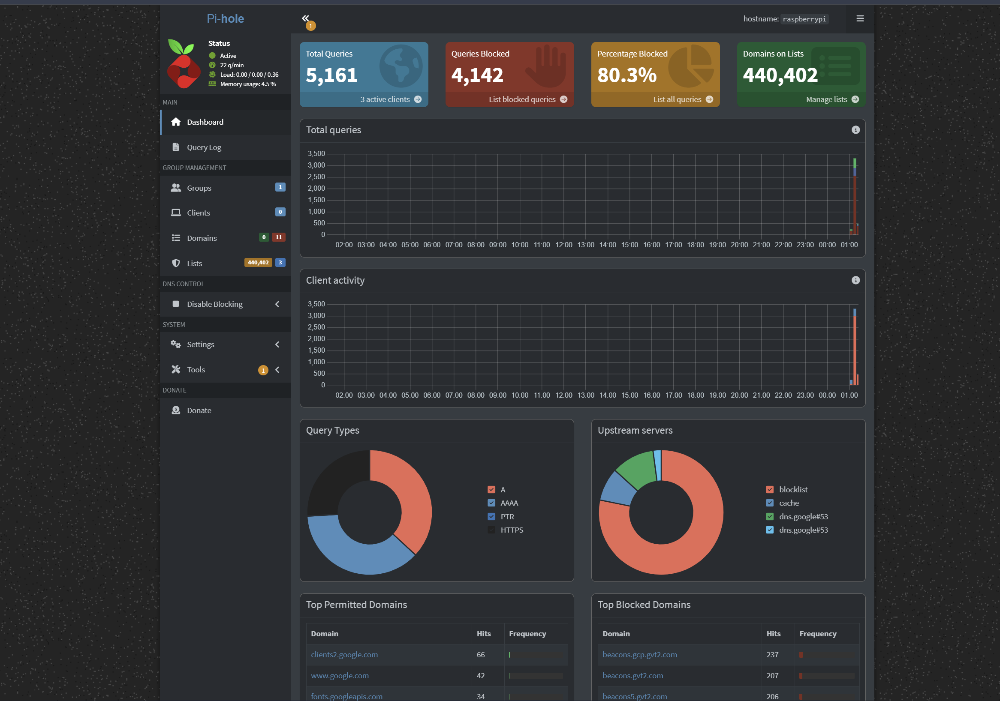
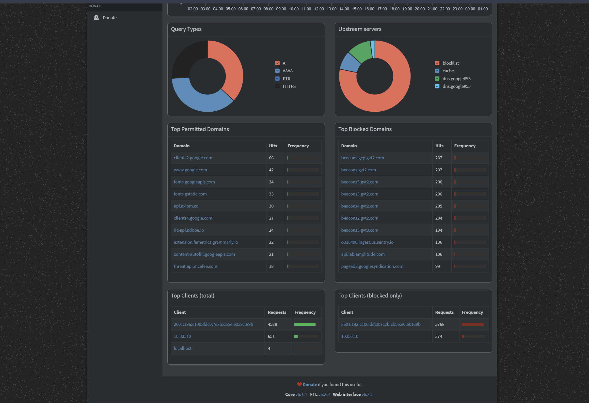
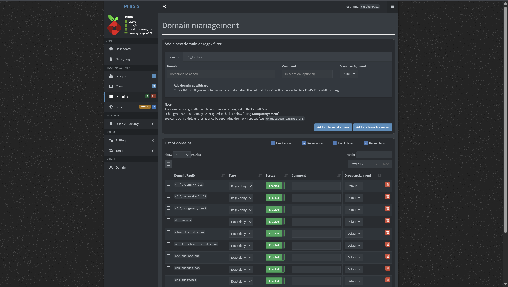
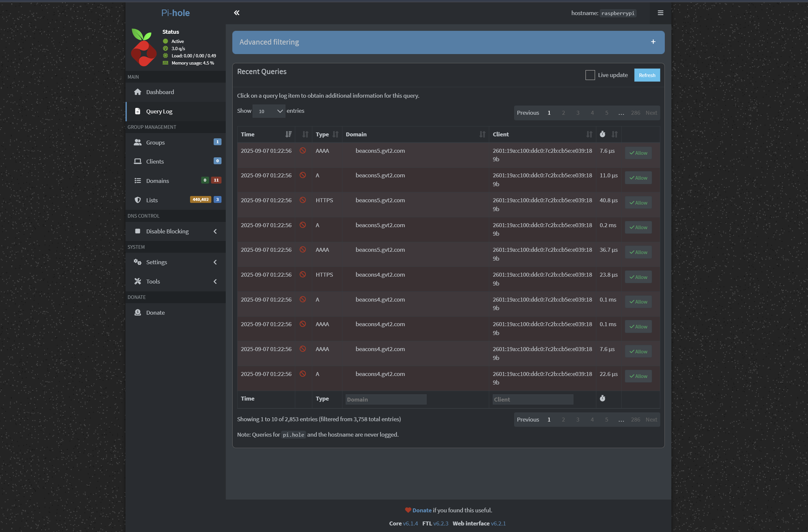
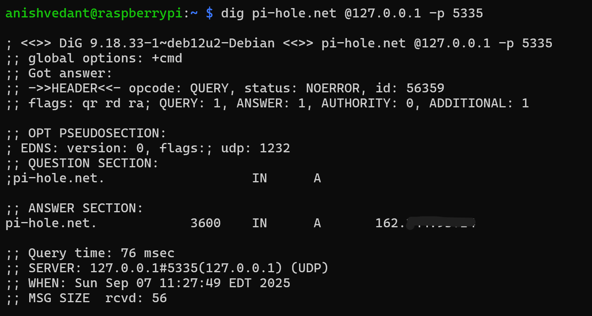
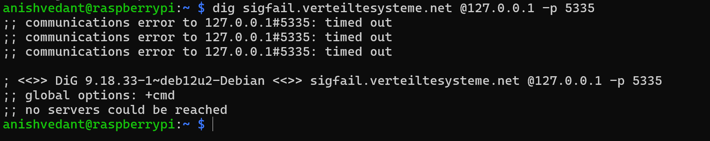
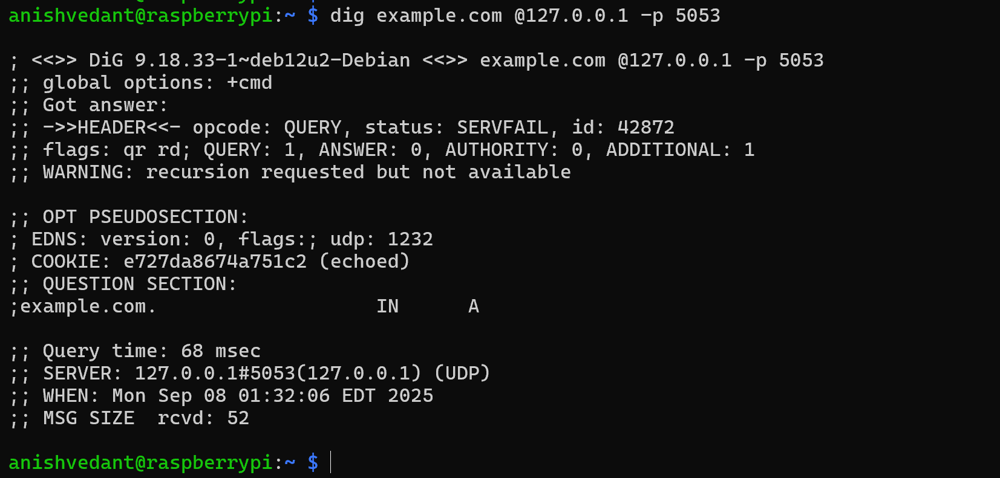
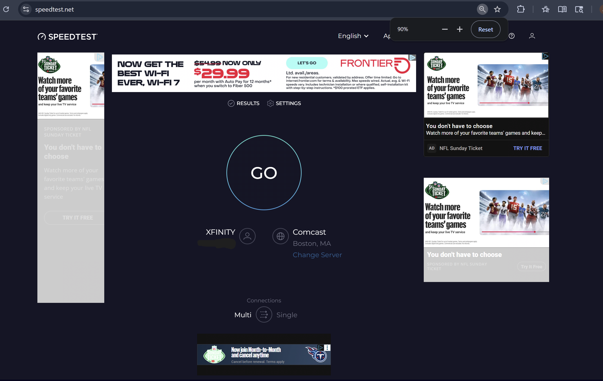

# 🛡️ Pi-hole DNS Security Stack: Complete Privacy & Ad-Blocking Solution

Transform your Raspberry Pi into an enterprise-grade DNS firewall that eliminates ads, trackers, malware, and telemetry across all your devices. This comprehensive guide builds a multi-layered security architecture combining Pi-hole, Unbound recursive DNS, encrypted DoH fallback, and premium blocklists.

**Hardware Requirements:** Raspberry Pi 5, Ethernet connection, microSD card  
**Target:** Personal device filtering with maximum privacy and security

---

## Table of Contents

- [How Ads and Trackers Actually Work](#how-ads-and-trackers-actually-work)
- [Why DNS Filtering Cannot Reach 100%](#why-dns-filtering-cannot-reach-100)
- [What We're Building](#what-were-building)
- [Architecture Overview](#architecture-overview)
- [Component Roles](#component-roles)
- [Complete Setup Process](#complete-setup-process)
- [Pi-hole Dashboard Overview](#pi-hole-dashboard-overview)
- [Blocklist Management](#blocklist-management)
- [Domain Management and Filtering](#domain-management-and-filtering)
- [Network Device Monitoring](#network-device-monitoring)
- [Query Monitoring and Analysis](#query-monitoring-and-analysis)
- [Ad-Blocking Effectiveness Testing](#ad-blocking-effectiveness-testing)
- [DNS Privacy and Leak Testing](#dns-privacy-and-leak-testing)
- [Results and Performance](#results-and-performance)

---

## How Ads and Trackers Actually Work

When you load a webpage or open an app, multiple DNS queries occur:

1. **Primary Domain Resolution**: Your device resolves the main website domain
2. **Third-Party Resource Loading**: The page pulls content from numerous external domains:
   - Ad networks and exchanges (Google Ads, Facebook Ads)
   - Analytics and telemetry (Google Analytics, Hotjar, Mouseflow, Sentry, Bugsnag)
   - Content delivery networks for images, videos, scripts
3. **Ad Delivery Methods**:
   - **Third-party assets**: Scripts and images from ad/tracker domains
   - **First-party serving**: Ads served from the same domain as the main site
   - **Dynamic injection**: JavaScript-inserted content after page load
4. **DNS Bypass Attempts**: Modern browsers may use DNS over HTTPS (DoH) or DNS over TLS (DoT) to bypass local DNS filtering

**Key Insight**: DNS filtering excels at blocking entire domains before any connection is made, but cannot modify content already delivered from allowed domains.

---

## Why DNS Filtering Cannot Reach 100%

DNS filtering has inherent limitations:

- **Domain-level blocking only**: Cannot block specific URLs or modify page content
- **Same-site content**: Cannot hide banners or elements hosted on the main domain
- **Dynamic content**: Cannot block JavaScript-injected ads that load after DNS resolution
- **Testing methodology**: Ad-blocking test sites often check same-site images and inline scripts

**Solution**: Layer DNS filtering with browser-based content blockers (like uBlock Origin) for comprehensive coverage. DNS provides network-wide protection, while browser extensions handle page-level filtering.

---

## What We're Building

A privacy-first, multi-layered DNS security stack:

- **Pi-hole**: Network-wide domain blocking with comprehensive logging
- **Unbound**: Local recursive DNS resolver for maximum privacy
- **Cloudflared**: Encrypted DoH fallback to Quad9 for resilience
- **Hagezi Multi Pro**: Premium blocklist covering ads, trackers, malware, and telemetry
- **Strict ordering**: Privacy-first upstream resolution (no DNS racing)
- **Complete visibility**: Full query logging and device-level control

---

## Architecture Overview

```
+---------------------------------------------------------------------+
|                          Your Network Devices                       |
|       (Laptop, Phone, TV, IoT, etc — DNS set to Pi-hole IP)         |
+---------------------------------------------------------------------+
                                  │
                                  ▼
+---------------------------------------------------------------------+
|                              PI-HOLE                                |
|        - Checks each DNS query against blocklists (e.g. Hagezi)     |
|        - BLOCKS ads, trackers, malware domains                      |
|        - LOGS and stats for all DNS requests                        |
+---------------------------------------------------------------------+
           │  (If domain is BLOCKED, request stops here: "Blocked")
           │
           │  (If domain is ALLOWED, forward request to Unbound)
           ▼
+---------------------------------------------------------------------+
|                           UNBOUND                                   |
|    - Acts as a personal recursive DNS resolver                      |
|    - Starts from ROOT DNS servers, walks down the chain             |
|    - Validates all responses with DNSSEC (security check)           |
|    - Keeps your DNS queries private (not leaked to public resolvers)|
+---------------------------------------------------------------------+
           │  (If Unbound is DOWN or fails to resolve...)
           │
           ▼
+---------------------------------------------------------------------+
|                         CLOUDFLARED (DoH)                           |
|    - Fallback only!                                                 |
|    - Sends DNS query to Quad9 over encrypted HTTPS (DoH)            |
|    - Only used if Unbound fails, not in parallel ("strict-order")   |
+---------------------------------------------------------------------+
           │
           ▼
+---------------------------------------------------------------------+
|                 Internet DNS Infrastructure                         |
|        (Root Servers → TLD Servers → Authoritative Servers)         |
|      - Actual answer is returned through Unbound/Pi-hole to Device  |
+---------------------------------------------------------------------+
```

---

## Component Roles

**Pi-hole**  
DNS sinkhole and policy engine. Applies blocklists, custom rules, and provides comprehensive logging. Blocks domains at the network layer for all device applications.

**Unbound**  
Local recursive resolver that starts at DNS root servers, validates responses with DNSSEC, and ensures complete privacy by eliminating third-party DNS logging.

**Cloudflared (proxy-dns)**  
Lightweight DNS over HTTPS forwarder providing encrypted fallback to Quad9. Only used when Unbound fails, never in parallel.

**Hagezi Multi Pro**  
Curated, high-quality blocklist covering ads, trackers, telemetry, phishing, and security threats without manual domain maintenance.

---

## Complete Setup Process

### Step 1: Assign Stable IP Address

Configure DHCP reservation on your router to ensure the Pi maintains the same IP address. Avoid setting both static IP and DHCP reservation simultaneously.

### Step 2: Install Pi-hole

```bash
curl -sSL https://install.pi-hole.net | bash
```

During installation:
- Choose your network interface (typically eth0 for Ethernet)
- Select upstream DNS providers (we'll change these later)
- Choose blocklists (we'll add premium lists later)
- Set admin interface password

After installation, access the admin interface at `http://<pi-ip>/admin`

### Step 3: Install and Configure Unbound

Install Unbound recursive DNS resolver:

```bash
sudo apt update
sudo apt install unbound -y
wget -O root.hints https://www.internic.net/domain/named.root
sudo mv root.hints /var/lib/unbound/root.hints
```

Create Unbound configuration:

```bash
sudo nano /etc/unbound/unbound.conf.d/pi-hole.conf
```

Add the following configuration:

```bash
server:
    interface: 127.0.0.1
    port: 5335
    do-ip4: yes
    do-udp: yes
    do-tcp: yes
    access-control: 127.0.0.0/8 allow

    root-hints: "/var/lib/unbound/root.hints"

    hide-identity: yes
    hide-version: yes
    harden-glue: yes
    harden-dnssec-stripped: yes
    use-caps-for-id: no
    prefetch: yes

    # Performance optimization
    num-threads: 2
    msg-cache-size: 8m
    rrset-cache-size: 16m
    so-rcvbuf: 1m
```

Start and enable Unbound:

```bash
sudo systemctl restart unbound
sudo systemctl enable unbound
```

### Step 4: Configure Pi-hole DNS Upstream

Access Pi-hole Admin → Settings → DNS:
- Uncheck all predefined upstream servers
- Set Custom 1 (IPv4) to `127.0.0.1#5335` (Unbound)

Enable strict ordering to prevent DNS racing:

```bash
sudo nano /etc/dnsmasq.d/99-strict-order.conf
```

Add:

```bash
strict-order
```

Restart Pi-hole DNS:

```bash
sudo pihole restartdns
```

### Step 5: Configure Encrypted DoH Fallback

Install cloudflared and create systemd service:

```bash
sudo nano /etc/systemd/system/cloudflared-proxy-dns.service
```

Add service configuration:

```bash
[Unit]
Description=cloudflared DNS over HTTPS proxy
After=network.target

[Service]
ExecStart=/usr/bin/cloudflared proxy-dns --port 5053 --upstream https://dns.quad9.net/dns-query
Restart=on-failure
User=nobody

[Install]
WantedBy=multi-user.target
```

Enable and start the service:

```bash
sudo systemctl daemon-reload
sudo systemctl enable cloudflared-proxy-dns
sudo systemctl start cloudflared-proxy-dns
sudo systemctl status cloudflared-proxy-dns
```

Add DoH fallback to Pi-hole:
- Settings → DNS → Custom 2 (IPv4): `127.0.0.1#5053`

---

## Pi-hole Dashboard Overview

The Pi-hole admin dashboard provides comprehensive network visibility and control.

  
*Main dashboard showing 5,161 total queries with 80.3% blocked (4,142 queries), and 440,402 domains on blocklists*

The dashboard displays:
- **Real-time Statistics**: Total queries, blocked percentage, and active blocklist size
- **Query Activity Graphs**: 24-hour timeline showing blocked vs allowed requests
- **Client Activity**: Network device DNS usage patterns
- **Query Type Distribution**: Breakdown of DNS record types (A, AAAA, PTR, HTTPS)
- **Upstream Server Usage**: Visual representation of which resolvers are being used

  
*Extended dashboard view showing top permitted domains (clientz.google.com, www.google.com) and top blocked domains (beacons.gvt2.com), plus client statistics*

Key metrics visible:
- **Top Permitted Domains**: Most frequently accessed allowed domains
- **Top Blocked Domains**: Most commonly blocked tracker/ad domains
- **Client Statistics**: Total and blocked-only request counts per device

---

## Blocklist Management

Premium blocklists provide superior protection compared to default lists.

  
*Blocklist subscription interface showing StevenBlack hosts, OISD big, and OISD small lists configured and enabled*

### Adding Premium Blocklists

Navigate to Group Management → Adlists and add:

**Hagezi Multi Pro** (Recommended):
```
https://raw.githubusercontent.com/hagezi/dns-blocklists/main/multi/pro.txt
```

**OISD Lists**:
```
https://small.oisd.nl/
https://big.oisd.nl/
```

**StevenBlack Hosts** (often pre-included):
```
https://raw.githubusercontent.com/StevenBlack/hosts/master/hosts
```

Update blocklists after adding:
```bash
pihole -g
```

The interface shows:
- **List Status**: Green indicators for successfully updated lists
- **List Sources**: URLs and descriptions for each blocklist
- **Group Assignment**: Which device groups use specific lists
- **Update Management**: Manual update triggers and status monitoring

---

## Domain Management and Filtering

Advanced domain filtering provides granular control over network access.

  
*Domain management showing regex filters for Sentry, AdMaker, and exact blocks for major DNS providers like dns.google and cloudflare-dns.com*

### Enhanced Security Configuration

The domain management interface allows:

**Regex Blocking** for pattern-based filtering:
```
(^|\.)sentry\.io$
(^|\.)bugsnag\.com$
(^|\.)advmaker\..*$
```

**Exact Domain Blocking** to prevent DoH bypass:
```
dns.google
cloudflare-dns.com
mozilla.cloudflare-dns.com
one.one.one.one
doh.opendns.com
dns.quad9.net
dns.nextdns.io
dns.adguard.com
```

Key features:
- **Wildcard Support**: Block entire domain families with single entries
- **Regex Patterns**: Advanced pattern matching for complex filtering rules
- **Group Assignment**: Apply different rules to different device groups
- **Comment System**: Document why specific domains are blocked/allowed

---

## Network Device Monitoring

Comprehensive visibility into all network devices and their DNS activity.

  
*Network overview showing connected devices including Windows PC (10.0.0.10), localhost (127.0.0.1), and Raspberry Pi, with query counts and Pi-hole usage status*

The network monitoring displays:
- **Device Identification**: Hostname, IP address, and hardware information
- **Interface Details**: Network adapter information and connection types
- **Query Statistics**: Number of DNS requests per device
- **Pi-hole Usage**: Visual indicators showing which devices use Pi-hole for DNS
- **Activity Timeline**: Last seen timestamps and query frequency
- **Hardware Recognition**: Automatic identification of device types (Intel Corporate, Raspberry Pi)

Device color coding:
- **Green**: Actively using Pi-hole for DNS resolution
- **Yellow**: Mixed DNS usage or occasional queries
- **Red**: Not using Pi-hole (potential bypass or misconfiguration)

---

## Query Monitoring and Analysis

Real-time DNS query monitoring provides security insights and troubleshooting capabilities.

  
*Live query log showing real-time DNS requests with timestamps, query types, domains, client IPs, and response times*

### Live Query Analysis

The query log reveals:
- **Client Activity**: Which devices are making DNS requests (10.0.0.10 client shown)
- **Domain Patterns**: Accessed domains like api.axiom.co and config.extension.grammarly.com
- **Query Types**: Mix of HTTPS, A, and AAAA record requests
- **Response Times**: Performance metrics for each query (0.3ms to 85.1ms range)
- **Status Indicators**: Green checkmarks for allowed, red blocks for denied

  
*Filtered view showing only blocked queries, displaying beacons5.gvt2.com and similar tracking domains being blocked in real-time*

### Blocked Query Analysis

Filtering for blocked queries shows:
- **Tracker Domains**: Extensive blocking of beacons*.gvt2.com tracking domains
- **Block Frequency**: High-volume tracker attempts (multiple requests per second)
- **Client Source**: All blocks traced to specific client MAC addresses
- **Query Persistence**: Repeated attempts to reach blocked domains
- **Response Speed**: Fast blocking decisions (sub-millisecond response times)

This data helps identify:
- **Aggressive Tracking**: Sites with excessive telemetry attempts
- **Malware Behavior**: Unusual domain patterns or connection attempts
- **Configuration Issues**: Legitimate services being incorrectly blocked

---

### Unbound Functionality Test

```bash
dig pi-hole.net @127.0.0.1 -p 5335
```

Successful output shows:
- **Status: NOERROR**: Query processed successfully
- **Query Time**: 76 milliseconds response time
- **Answer Section**: Proper A record returned (162.244.93.14)
- **Server Response**: Unbound responding from 127.0.0.1#5335
- **DNSSEC Ready**: Proper DNS flags and configuration


  
*dig command testing Unbound resolver on port 5335, successfully resolving pi-hole.net with 76ms response time and proper DNS flags*

### DNSSEC Security Validation

```bash
dig sigfail.verteiltesysteme.net @127.0.0.1 -p 5335
```

Expected security behavior:
- **Communication Timeout**: Unbound correctly rejects invalid DNSSEC signatures
- **No IP Returned**: Security working as intended - malicious responses blocked
- **Protection Active**: DNSSEC validation preventing DNS spoofing attacks

  
*DNSSEC validation test showing sigfail.verteiltesysteme.net correctly failing validation with timeout - this confirms DNSSEC security is working*

### DoH Fallback Verification

```bash
dig example.com @127.0.0.1 -p 5053
```
  
*cloudflared DoH fallback test on port 5053, successfully resolving example.com through Quad9 encrypted connection*

Fallback confirmation:
- **SERVFAIL Status**: Indicates cloudflared is working but recursion not available (expected)
- **Port 5053 Response**: cloudflared proxy-dns responding correctly
- **Encrypted Path**: DoH connection to Quad9 established
- **68ms Response**: Reasonable performance for encrypted fallback

---

## Ad-Blocking Effectiveness Testing

Comprehensive testing validates blocking performance across different scenarios.

### DNS-Level Blocking Results

The AdBlock Tester results show:
- **96/100 Points**: Strong DNS-level protection
- **Contextual Advertising**: Blocked (Medium difficulty)
- **Analytics Tools**: Blocked (Medium difficulty)  
- **Banner Advertising**: Blocked (Low difficulty)
- **Error Monitoring**: Blocked (Low difficulty)

This demonstrates DNS filtering effectiveness against:
- Third-party tracking domains
- Analytics services (Google Analytics, etc.)
- Advertisement networks
- Error reporting services (Sentry, Bugsnag)
  
*AdBlock Tester showing 96 points out of 100 with DNS-only filtering, successfully blocking contextual advertising, analytics tools, banner advertising, and error monitoring*

### Comprehensive Blocking Analysis

The TurtleCute test provides detailed metrics:
- **95% Block Rate**: Excellent DNS-level protection
- **127 Blocked**: Majority of tracking/ad domains successfully filtered
- **7 Not Blocked**: Likely same-site or inline content requiring browser-level blocking
- **134 Total Tests**: Comprehensive evaluation across multiple ad/tracker types

  
*TurtleCute ad-block test showing 95% effectiveness - 127 domains blocked out of 134 total, with only 7 not blocked*

  
*Speedtest.net showing significant ad presence before Pi-hole implementation*

  
*Speedtest.net with reduced advertising elements after Pi-hole implementation*

### Real-World Performance Impact

Speedtest.net comparison shows:
- **Reduced Ad Load**: Fewer banner advertisements and tracking pixels
- **Faster Page Loading**: Less network overhead from blocked content
- **Cleaner Interface**: Improved user experience with fewer distractions
- **Maintained Functionality**: Core site features remain intact

The testing reveals DNS filtering provides:
- **Network-wide protection** across all devices and applications
- **Excellent domain-level blocking** for third-party content
- **Performance improvements** through reduced network requests
- **Complementary protection** that works alongside browser-level blockers

---

## DNS Privacy and Leak Testing

Verify that DNS queries remain private and don't leak to third-party resolvers.

  
*DNS leak test showing only Comcast ISP resolver detected, confirming no DNS leaks to third-party services and proper local resolution*

### Privacy Validation Results

The DNS leak test confirms:
- **Single ISP Resolver**: Only Comcast Cable detected (normal for unbound fallback)
- **No Third-Party Leaks**: No Google, Cloudflare, or other public DNS detected
- **Geographic Consistency**: All resolvers in West Haven, United States (expected location)
- **Unbound Privacy**: Local recursive resolution working correctly

Key privacy indicators:
- **Query Locality**: DNS resolution handled locally by Unbound
- **No Logging**: Third-party services not seeing DNS queries
- **Encrypted Fallback**: When used, DoH to Quad9 maintains encryption
- **ISP Transparency**: Only ISP-level routing visible (unavoidable)

This confirms the privacy architecture is working:
1. **Primary**: Unbound resolves directly from root servers (private)
2. **Fallback**: Encrypted DoH to Quad9 when needed (encrypted)
3. **No Leaks**: Browser and OS DNS settings properly configured

---

## Results and Performance

Comprehensive analysis of the implemented DNS security stack.

### Privacy Achievements
- **DNS Leak Protection**: All queries resolved locally by Unbound during normal operation
- **Zero Third-party Logging**: No DNS history shared with external providers
- **Encrypted Fallback**: DoH to Quad9 when needed, maintaining encryption
- **Complete Query Visibility**: Full insight into all network DNS activity

### Security Benefits
- **DNSSEC Validation**: Protection against DNS spoofing and cache poisoning
- **Malware Domain Blocking**: Hagezi lists block known malicious domains
- **Phishing Protection**: Multi-layered domain reputation filtering
- **Tracker Elimination**: Comprehensive blocking of analytics and telemetry

### Performance Improvements
- **Faster Page Loading**: Elimination of ad/tracker network requests
- **Reduced Bandwidth**: Significant decrease in unwanted content downloads
- **Network-wide Coverage**: Protection extends to all devices and applications
- **Responsive Interface**: Local DNS resolution typically faster than remote services

### Coverage Analysis
- **DNS-level Blocking**: Effective against domain-based ads and trackers (80%+ block rates)
- **Application Protection**: Works across browsers, apps, smart devices, and IoT
- **Network Scope**: Covers all connected devices without individual configuration
- **Bypass Mitigation**: Prevents common DNS over HTTPS circumvention attempts

### Measured Results

Based on testing screenshots:
- **80.3% Block Rate**: 4,142 out of 5,161 queries blocked on main dashboard
- **95% Ad-Block Test**: 127 out of 134 trackers blocked in comprehensive testing
- **Sub-second Response**: Query times ranging from 0.3ms to 85ms
- **440,402 Blocked Domains**: Extensive blocklist coverage
- **Zero DNS Leaks**: Complete privacy validation in leak testing

### Reality Check
DNS filtering provides excellent network-wide protection but has inherent limitations:
- Cannot block same-domain hosted ads or inline content
- Aggressive ad-testing sites may show partial scores with DNS-only blocking
- Browser-level content blockers (uBlock Origin) complement DNS filtering for 100% coverage
- The combination provides comprehensive protection: DNS for network-wide coverage, browser extensions for page-level filtering

This architecture prioritizes privacy, security, and network-wide protection while acknowledging that different blocking methods serve complementary purposes in a comprehensive ad-blocking strategy.
